# File Structure Diagram

```mermaid
graph TD
    subgraph ENTRY["Entry Points"]
        WEB([Web UI\nBrowser])
        ROS2([ROS2\nGraspPoseClientNode])
        CLI([vg_roi_pipeline.py\nCLI standalone])
    end

    subgraph GS["grasp_server/"]
        APP["app.py\nFastAPI routes & shared state"]
        CFG["config.py\nServerConfig"]
        REQ["request_handling.py\nmaterialize_capture / materialize_request"]
        PR["pipeline_runner.py\nrun_vg_pipeline"]

        subgraph GS_GEN["Grasp Generation (server-side)"]
            ALIGN_G["align_grasp.py\nbuild_align_grasp"]
            GSEL["grasp_selection.py\nselect_top_k_grasps"]
        end

        subgraph GS_EVAL["Filter & Score"]
            GFILT["grasp_filter.py\nfilter_grasps\n(hard filters + soft scores)"]
            GSCOR["grasp_scorer.py\nrank_grasps / compute_composite_score"]
        end

        GVIZ["grasp_viz.py\nsave_grasp_viz / save_grasp_viz_3d / _best"]
        CGNCL["cgn_client.py\nCgnWorker (async subprocess mgr)"]
        CGNWK["cgn_worker.py\nCGN subprocess entry point"]
        UI["ui.py\nSingle-page HTML"]
    end

    subgraph VGP["vg_pipeline/"]
        IO["io.py\nnew_run_id / load_observation_npy\nresolve_capture_dir"]
        PIPE["pipeline.py\nrun_pipeline\n(Option B full pipeline)"]
        PROM["prompting.py\nbuild_align_prompt_multi\nbuild_grounding_prompt"]
        PROV["providers.py\nrun_vg_inference\n(OpenAI / Gemini)"]
        ALIGN_P["align.py\nparse_align_results_multi\ndeproject_pixel"]
        ROI["roi.py\nparse_vlm_result\nsave_box_overlay_png"]
        SAM2["sam2_segment.py\nrun_sam2_segmentation\nrun_sam2_global / _local"]
        GEO["geometry.py\nbackproject_depth_with_mask\nrender_pointcloud_3d_png"]
        GR["grasp_results.py\nNormalizedGrasp\nnormalize_predictions_multi"]
        CLEAN["clean3d.py\npoint-cloud cleaning"]
        MAN["manifest.py\nwrite_manifest"]
    end

    subgraph EXT["External Systems"]
        VLM_API(["VLM API\nOpenAI / Gemini"])
        SAM2_M(["SAM2 Model\n(on-device)"])
        CGN_BIN(["Contact-GraspNet\nsubprocess  *.npz I/O"])
    end

    %% ── Entry → server ──────────────────────────────────────────
    WEB  -->|"POST /run_grasp\n/run_align\n/trigger_ik_check\n/select_and_execute"| APP
    ROS2 -->|"GET /poll_capture_request\nGET /poll_publish\nPOST /upload_capture\nPOST /submit_ik_result"| APP
    CLI  --> PIPE

    %% ── app.py central hub ───────────────────────────────────────
    APP --> CFG
    APP --> REQ
    APP --> PR
    APP --> GFILT
    APP --> GSCOR
    APP --> GSEL
    APP --> ALIGN_G
    APP --> GVIZ
    APP --> CGNCL
    APP --> PROM
    APP --> PROV
    APP --> ALIGN_P
    APP --> IO
    APP -.->|"serves HTML"| UI

    %% ── pipeline_runner ─────────────────────────────────────────
    PR --> PIPE

    %% ── vg_pipeline internal ────────────────────────────────────
    PIPE --> IO
    PIPE --> PROV
    PIPE --> ROI
    PIPE --> SAM2
    PIPE --> GEO
    PIPE --> CLEAN
    PIPE --> MAN
    PROV --> PROM

    %% ── grasp_server → vg_pipeline cross-package ────────────────
    GSEL  --> GR
    GFILT --> GR
    ALIGN_G --> ALIGN_P

    %% ── CGN subprocess chain ────────────────────────────────────
    CGNCL --> CGNWK
    CGNWK -->|"subprocess\n.npz files"| CGN_BIN

    %% ── External calls ──────────────────────────────────────────
    PROV -->|"HTTPS API"| VLM_API
    SAM2 --> SAM2_M

    %% ── Styling ─────────────────────────────────────────────────
    style GS      fill:#e3f2fd,stroke:#1565c0
    style GS_GEN  fill:#e8f5e9,stroke:#2e7d32
    style GS_EVAL fill:#fce4ec,stroke:#880e4f
    style VGP     fill:#fff8e1,stroke:#f57f17
    style EXT     fill:#f3e5f5,stroke:#6a1b9a
    style ENTRY   fill:#eceff1,stroke:#455a64
```

## Module roles at a glance

| File | Role |
|---|---|
| `grasp_server/app.py` | FastAPI app; owns all HTTP routes and shared state (`pending_capture`, `ik_results`, `pending_publish`) |
| `grasp_server/config.py` | `ServerConfig` dataclass — paths, thresholds, model names |
| `grasp_server/request_handling.py` | Decode multipart uploads; populate `MaterializedCapture` |
| `grasp_server/pipeline_runner.py` | Thin wrapper: call `vg_pipeline.run_pipeline`, collect CGN NPZ exports |
| `grasp_server/align_grasp.py` | Option C: back-project 2D align point → 6-DoF `GraspDict` |
| `grasp_server/grasp_selection.py` | Deserialise CGN NPZ → `GraspDict[]`; `select_top_k_grasps` |
| `grasp_server/grasp_filter.py` | Hard filters (width, collision) + soft scores (clearance, collision, contact quality) |
| `grasp_server/grasp_scorer.py` | Composite score = clearance×0.30 + collision×0.25 + width_margin×0.25 + contact×0.20 |
| `grasp_server/grasp_viz.py` | 2-D overlay and 3-D point-cloud visualisations; gold-overlay best-grasp JPEG |
| `grasp_server/cgn_client.py` | `CgnWorker`: async subprocess lifecycle for the CGN worker |
| `grasp_server/cgn_worker.py` | CGN subprocess entry — loads model, reads input NPZ, writes predictions NPZ |
| `grasp_server/ui.py` | Inline single-page HTML served at `/` |
| `vg_pipeline/pipeline.py` | Option B full pipeline: VLM → SAM2 → CGN input NPZ export |
| `vg_pipeline/prompting.py` | Prompt templates for align and grounding tasks |
| `vg_pipeline/providers.py` | `run_vg_inference`: OpenAI / Gemini API calls |
| `vg_pipeline/align.py` | Parse VLM JSON → `AlignResult`; depth back-projection helpers |
| `vg_pipeline/roi.py` | Parse bounding-box JSON from VLM; crop / overlay utilities |
| `vg_pipeline/sam2_segment.py` | SAM2 model wrapper; global and local segmentation modes |
| `vg_pipeline/geometry.py` | Depth back-projection; 3-D point-cloud rendering |
| `vg_pipeline/grasp_results.py` | `NormalizedGrasp` dataclass; `normalize_predictions_multi` from CGN NPZ |
| `vg_pipeline/io.py` | Run-ID generation; `load_observation_npy`; path resolution helpers |
| `vg_pipeline/clean3d.py` | Statistical outlier removal on point clouds |
| `vg_pipeline/manifest.py` | Write per-run JSON manifest |
| `vg_roi_pipeline.py` | CLI entry point — run Option B pipeline directly from `.npy` files |
