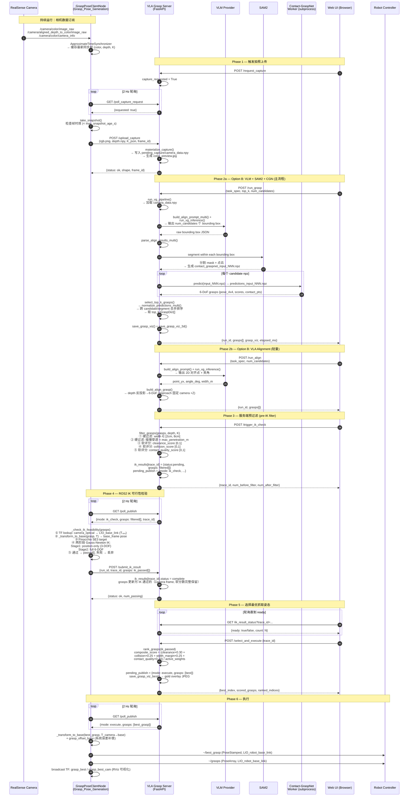
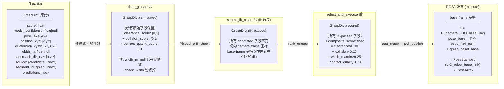

# System Diagrams

## 时序图 (Sequence Diagram)



---

## 流程图 (Flowchart)

```mermaid
flowchart TD
    subgraph CAM["相机 & ROS2 节点 (持续运行)"]
        A([RealSense Camera]) -->|color + depth + camera_info| B[ApproximateTimeSynchronizer]
        B --> C[(缓存最新同步帧)]
    end

    subgraph WEBUI["Web UI 触发流 (主流)"]
        direction TB
        W1([用户打开 Web UI]) --> W2[POST /request_capture]
        W2 --> W3{ROS2 poll_capture_request?}
        W3 -->|Yes| W4[ROS2: take_snapshot\n→ POST /upload_capture]
        W4 --> W5[(Server: pending_capture\ncamera_data.npy)]
        W5 --> W6{选择生成方式}

        W6 -->|Option A VLM+SAM2+CGN| OB[POST /run_grasp]
        W6 -->|Option B VLA对齐| OC[POST /run_align]

        subgraph OPT_B["Option A — VLM + SAM2 + CGN"]
            OB --> B1[build_align_prompt_multi\n→ VLM 推理]
            B1 --> B2[parse_align_results_multi\n→ num_candidates 个 bounding box]
            B2 --> B3[SAM2 分割 → mask + 点云]
            B3 --> B4[导出 contact_graspnet_input_NNN.npz]
            B4 --> B5[CGN Worker subprocess\n→ predictions_input_NNN.npz\n6-DoF grasps + scores]
            B5 --> B6[normalize_predictions_multi\n→ 跨 candidate 合并排序\n→ top_k GraspDict]
        end

        subgraph OPT_C["Option B — VLA 对齐 (轻量)"]
            OC --> C1[build_align_prompt\n→ VLM 推理]
            C1 --> C2[parse: point_yx, angle_deg, width_m]
            C2 --> C3[depth 反投影 5×5 中值\n→ 3D position]
            C3 --> C4[build_align_grasp\napproach 固定 camera +Z\nscore 固定 1.0]
        end

        B6 & C4 --> GEN_OUT([grasps: GraspDict[]\npose_4x4, quaternion_xyzw\nwidth_m, approach_dir_xyz\nscore, source])
        GEN_OUT --> VIZ[save_grasp_viz\nsave_grasp_viz_3d]
    end

    subgraph FILTER["服务端预过滤 /trigger_ik_check"]
        F0[加载 depth + K\nfrom pending_capture] --> F1
        GEN_OUT --> F1

        F1{check_width\nwidth_m ∈ 2–8 cm?}
        F1 -->|No| REJ_W[rejected_width]
        F1 -->|Yes| F2{_score_collision\n穿透 > max_penetration?}
        F2 -->|Yes| REJ_C[rejected_collision]
        F2 -->|No| F3[计算软评分\nclearance_score\ncollision_score\ncontact_quality_score]
        F3 --> F4[(ik_results\ntrace_id → pending\nfiltered_grasps[])]
        F4 --> F5[pending_publish\nmode: ik_check]
    end

    subgraph IK["ROS2 IK 可行性检验 (2 Hz 轮询)"]
        I1[GET /poll_publish\n→ mode: ik_check] --> I2[TF lookup\ncamera_optical → LIO_base_link\nT₄ₓ₄]
        I2 --> I3[_transform_to_base\ngrasp camera frame → base frame]
        I3 --> I4[Pinocchio SE3 target\nq_xyzw → Rotation + translation]
        I4 --> I5{两阶段 Gauss-Newton IK\nStage1: position-only\nStage2: full 6-DOF}
        I5 -->|收敛 q_solution| I6[passed_grasps\n保留 camera-frame dict\n含软评分字段]
        I5 -->|未收敛| I7[丢弃该候选]
        I6 --> I8[POST /submit_ik_result\ntrace_id, grasps: passed]
        I8 --> I9[(ik_results\ntrace_id → complete)]
    end

    subgraph SCORE["评分 & 选择 /select_and_execute"]
        S1[rank_grasps\nIK 通过候选] --> S2[compute_composite_score\nclearance × 0.30\ncollision × 0.25\nwidth_margin × 0.25\ncontact_quality × 0.20]
        S2 --> S3[排序 → best_grasp\nsave_grasp_viz_best\ngold overlay]
        S3 --> S4[pending_publish\nmode: execute\ngrasps: best_grasp]
    end

    subgraph EXEC["执行 (ROS2 2 Hz 轮询)"]
        E1[GET /poll_publish\n→ mode: execute] --> E2[_transform_to_base\nbest_grasp → base frame\n+ grasp_offset_base 误差补偿]
        E2 --> E3[~/best_grasp\nPoseStamped\nLIO_robot_base_link]
        E2 --> E4[~/grasps\nPoseArray]
        E2 --> E5[broadcast TF\ngrasp_best frame\nRViz 可视化]
    end

    subgraph DIRECT["直接 API 流 (旧版 /grasp)"]
        D1[POST /grasp\nrgb + depth + K\ntask_spec + frame_id] --> D2[materialize_request\n写入 capture_dir]
        D2 --> D3[run_vg_pipeline\nVLM+SAM2+CGN]
        D3 --> D4[select_top_k_grasps]
        D4 --> D5[返回 JSONResponse\ngrasps[]]
    end

    C --> W4
    F5 --> I1
    I9 --> S1
    S4 --> E1

    style OPT_B fill:#e3f2fd,stroke:#2196f3
    style OPT_C fill:#fff3e0,stroke:#ff9800
    style FILTER fill:#fce4ec,stroke:#e91e63
    style IK fill:#f3e5f5,stroke:#9c27b0
    style SCORE fill:#e8eaf6,stroke:#3f51b5
    style EXEC fill:#e0f2f1,stroke:#009688
    style DIRECT fill:#f5f5f5,stroke:#9e9e9e,stroke-dasharray: 5 5
```

---

## 关键数据结构流转


