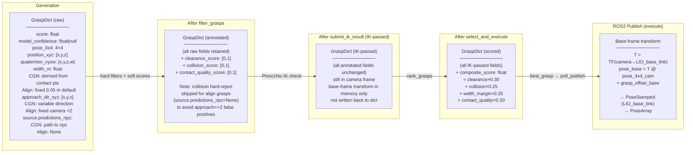

# System Diagrams

## Sequence Diagram

```mermaid
sequenceDiagram
    autonumber
    participant Camera as RealSense Camera
    participant ROS2 as GraspPoseClientNode<br/>(Grasp_Pose_Generation)
    participant Server as VLA Grasp Server<br/>(FastAPI)
    participant VLM as VLM Provider
    participant SAM2 as SAM2
    participant CGN as Contact-GraspNet<br/>Worker (subprocess)
    participant WebUI as Web UI (Browser)
    participant Robot as Robot Controller

    Note over Camera,ROS2: Continuous: camera subscription
    Camera->>ROS2: /camera/color/image_raw<br/>/camera/aligned_depth_to_color/image_raw<br/>/camera/color/camera_info
    ROS2->>ROS2: ApproximateTimeSynchronizer<br/>→ cache latest synced frame (color, depth, K)

    Note over WebUI,Server: Phase 1 — Capture trigger & upload
    WebUI->>Server: POST /request_capture
    Server->>Server: capture_requested = True

    loop Poll at 2 Hz
        ROS2->>Server: GET /poll_capture_request
        Server-->>ROS2: {requested: true}
    end

    ROS2->>ROS2: take_snapshot()<br/>check frame age (< max_snapshot_age_s)
    ROS2->>Server: POST /upload_capture<br/>(rgb.png, depth.npy, K_json, frame_id)
    Server->>Server: materialize_capture()<br/>→ write pending_capture/camera_data.npy<br/>→ generate color_preview.jpg
    Server-->>ROS2: {status: ok, shape, frame_id}

    Note over WebUI,Server: Phase 2a — Option A: VLM + SAM2 + CGN (main pipeline)
    WebUI->>Server: POST /run_grasp<br/>(task_spec, top_k, num_candidates)
    Server->>Server: run_vg_pipeline()<br/>→ load camera_data.npy
    Server->>VLM: build_align_prompt_multi() +<br/>run_vg_inference()<br/>→ num_candidates bounding boxes
    VLM-->>Server: raw bounding box JSON
    Server->>Server: parse_align_results_multi()
    Server->>SAM2: segment within each bounding box
    SAM2-->>Server: segmentation mask + point cloud<br/>→ export contact_graspnet_input_NNN.npz
    loop per candidate npz
        Server->>CGN: predict(input_NNN.npz) → predictions_input_NNN.npz
        CGN-->>Server: 6-DoF grasps (pose_4x4, scores, contact_pts)
    end
    Server->>Server: select_top_k_grasps()<br/>→ normalize_predictions_multi()<br/>→ merge & rank across candidates/segments<br/>→ top_k GraspDict[]
    Server->>Server: save_grasp_viz() + save_grasp_viz_3d()
    Server-->>WebUI: {run_id, grasps[], grasp_viz, elapsed_ms}

    Note over WebUI,Server: Phase 2b — Option B: VLA Alignment (lightweight)
    WebUI->>Server: POST /run_align<br/>(task_spec, num_candidates)
    Server->>VLM: build_align_prompt_multi() + run_vg_inference()<br/>→ 2D align point + gripper angle per candidate
    VLM-->>Server: align_point [y,x], gripper_angle_deg
    Server->>Server: build_align_grasp()<br/>→ depth back-projection (5×5 median)<br/>→ 6-DoF pose (approach fixed to camera +Z)<br/>→ width_m = 0.05 m (fixed default, not estimated by LLM)
    Server-->>WebUI: {run_id, grasps[]}

    Note over WebUI,Server: Phase 3 — Server-side pre-IK filter
    WebUI->>Server: POST /trigger_ik_check
    Server->>Server: filter_grasps(grasps, depth, K)<br/>① Hard filter: width_m ∈ [2 cm, 8 cm]<br/>② Hard filter: collision penetration < max_penetration_m<br/>   (skipped for align-path grasps — approach=+Z causes false positives)<br/>③ Soft score: clearance_score [0,1]<br/>④ Soft score: collision_score [0,1]<br/>⑤ Soft score: contact_quality_score [0,1]
    Server->>Server: ik_results[trace_id] = {status: pending,<br/>grasps: filtered[]}<br/>pending_publish = {mode: ik_check, ...}
    Server-->>WebUI: {trace_id, num_before_filter, num_after_filter}

    Note over ROS2,Server: Phase 4 — ROS2 IK feasibility check
    loop Poll at 2 Hz
        ROS2->>Server: GET /poll_publish
        Server-->>ROS2: {mode: ik_check, grasps: filtered[], trace_id}
    end

    ROS2->>ROS2: _check_ik_feasibility(grasps)<br/>① TF lookup: camera_optical → LIO_base_link (T₄ₓ₄)<br/>② _transform_to_base(grasp, T) → base-frame pose<br/>③ Pinocchio SE3 target<br/>④ Two-stage Gauss-Newton IK:<br/>   Stage1: position-only (3-DOF)<br/>   Stage2: full 6-DOF<br/>⑤ Converged → passed[], failed → discard
    ROS2->>Server: POST /submit_ik_result<br/>{run_id, trace_id, grasps: ik_passed[]}
    Server->>Server: ik_results[trace_id].status = complete<br/>grasps updated to IK-passing set (camera frame, soft scores intact)
    Server-->>ROS2: {status: ok, num_passing}

    Note over WebUI,Server: Phase 5 — Best-grasp selection
    loop Poll until ready
        WebUI->>Server: GET /ik_result_status?trace_id=...
        Server-->>WebUI: {ready: true/false, count: N}
    end

    WebUI->>Server: POST /select_and_execute {trace_id}
    Server->>Server: rank_grasps(ik_passed)<br/>composite_score = (clearance×0.30 +<br/>collision×0.25 + width_margin×0.25 +<br/>contact_quality×0.20) / active_weights
    Server->>Server: pending_publish = {mode: execute, grasps: [best]}<br/>save_grasp_viz_best() → gold-overlay JPEG
    Server-->>WebUI: {best_index, scored_grasps, ranked_indices}

    Note over ROS2,Robot: Phase 6 — Execution
    loop Poll at 2 Hz
        ROS2->>Server: GET /poll_publish
        Server-->>ROS2: {mode: execute, grasps: [best_grasp]}
    end

    ROS2->>ROS2: _transform_to_base(best_grasp, T_camera→base)<br/>+ grasp_offset_base (systematic error compensation)
    ROS2->>Robot: ~/best_grasp (PoseStamped, LIO_base_link)
    ROS2->>Robot: ~/grasps (PoseArray, LIO_base_link)
    ROS2->>ROS2: broadcast TF: grasp_best / grasp_best_cam (RViz visualisation)
```



---

## Flowchart

```mermaid
flowchart TD
    subgraph CAM["Camera & ROS2 Node (continuous)"]
        A([RealSense Camera]) -->|color + depth + camera_info| B[ApproximateTimeSynchronizer]
        B --> C[(Cache latest synced frame)]
    end

    subgraph WEBUI["Web UI Trigger Flow"]
        direction TB
        W1([User opens Web UI]) --> W2[POST /request_capture]
        W2 --> W3{ROS2 poll_capture_request?}
        W3 -->|Yes| W4[ROS2: take_snapshot\n→ POST /upload_capture]
        W4 --> W5[(Server: pending_capture\ncamera_data.npy)]
        W5 --> W6{Choose pipeline}

        W6 -->|Option A — VLM+SAM2+CGN| OA[POST /run_grasp]
        W6 -->|Option B — VLA align| OB[POST /run_align]

        subgraph OPT_A["Option A — VLM + SAM2 + CGN"]
            OA --> A1[build_align_prompt_multi\n→ VLM inference]
            A1 --> A2[parse_align_results_multi\n→ num_candidates bounding boxes]
            A2 --> A3[SAM2 segmentation → mask + point cloud]
            A3 --> A4[Export contact_graspnet_input_NNN.npz]
            A4 --> A5[CGN Worker subprocess\n→ predictions_input_NNN.npz\n6-DoF grasps + scores]
            A5 --> A6[normalize_predictions_multi\n→ merge & rank across candidates\n→ top_k GraspDict]
        end

        subgraph OPT_B["Option B — VLA Alignment (lightweight)"]
            OB --> B1[build_align_prompt_multi\n→ VLM inference]
            B1 --> B2[parse: align_point [y,x], gripper_angle_deg\nwidth_mm NOT requested from LLM]
            B2 --> B3[depth back-projection 5×5 median\n→ 3D position]
            B3 --> B4[build_align_grasp\napproach fixed to camera +Z\nwidth_m = 0.05 m default]
        end

        A6 & B4 --> GEN_OUT([grasps: GraspDict[]\npose_4x4, quaternion_xyzw\nwidth_m, approach_dir_xyz\nscore, source])
        GEN_OUT --> VIZ[save_grasp_viz\nsave_grasp_viz_3d]
    end

    subgraph FILTER["Server-side Pre-IK Filter  /trigger_ik_check"]
        F0[Load depth + K\nfrom pending_capture] --> F1
        GEN_OUT --> F1

        F1{check_width\nwidth_m ∈ 2–8 cm?}
        F1 -->|No| REJ_W[rejected_width]
        F1 -->|Yes| F2{_score_collision\npenetration > max_penetration?\nSkipped for align grasps\nsource.predictions_npz = None}
        F2 -->|Yes — CGN only| REJ_C[rejected_collision]
        F2 -->|No / align path| F3[Compute soft scores\nclearance_score\ncollision_score\ncontact_quality_score]
        F3 --> F4[(ik_results\ntrace_id → pending\nfiltered_grasps[])]
        F4 --> F5[pending_publish\nmode: ik_check]
    end

    subgraph IK["ROS2 IK Feasibility Check (2 Hz poll)"]
        I1[GET /poll_publish\n→ mode: ik_check] --> I2[TF lookup\ncamera_optical → LIO_base_link\nT₄ₓ₄]
        I2 --> I3[_transform_to_base\ngrasp camera frame → base frame]
        I3 --> I4[Pinocchio SE3 target\nq_xyzw → Rotation + translation]
        I4 --> I5{Two-stage Gauss-Newton IK\nStage1: position-only\nStage2: full 6-DOF}
        I5 -->|converged q_solution| I6[passed_grasps\ncamera-frame dict retained\nsoft scores preserved]
        I5 -->|not converged| I7[discard candidate]
        I6 --> I8[POST /submit_ik_result\ntrace_id, grasps: passed]
        I8 --> I9[(ik_results\ntrace_id → complete)]
    end

    subgraph SCORE["Scoring & Selection  /select_and_execute"]
        S1[rank_grasps\nIK-passing candidates] --> S2[compute_composite_score\nclearance × 0.30\ncollision × 0.25\nwidth_margin × 0.25\ncontact_quality × 0.20]
        S2 --> S3[rank → best_grasp\nsave_grasp_viz_best\ngold overlay]
        S3 --> S4[pending_publish\nmode: execute\ngrasps: best_grasp]
    end

    subgraph EXEC["Execution (ROS2 2 Hz poll)"]
        E1[GET /poll_publish\n→ mode: execute] --> E2[_transform_to_base\nbest_grasp → base frame\n+ grasp_offset_base error compensation]
        E2 --> E3[~/best_grasp\nPoseStamped\nLIO_base_link]
        E2 --> E4[~/grasps\nPoseArray]
        E2 --> E5[broadcast TF\ngrasp_best frame\nRViz visualisation]
    end

    C --> W4
    F5 --> I1
    I9 --> S1
    S4 --> E1

    style OPT_A fill:#e3f2fd,stroke:#2196f3
    style OPT_B fill:#fff3e0,stroke:#ff9800
    style FILTER fill:#fce4ec,stroke:#e91e63
    style IK fill:#f3e5f5,stroke:#9c27b0
    style SCORE fill:#e8eaf6,stroke:#3f51b5
    style EXEC fill:#e0f2f1,stroke:#009688
```

---

## Key Data Structure Flow


